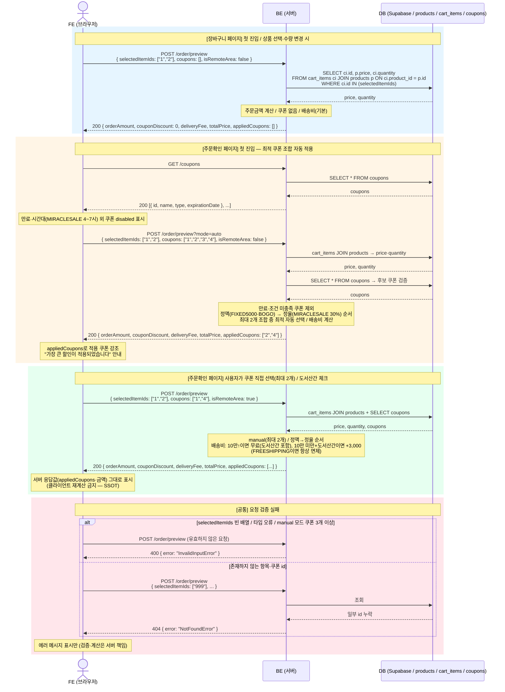

```mermaid
sequenceDiagram
actor FE as FE (브라우저)
participant BE as BE (서버)
participant DB as DB (Supabase / products / cart_items / coupons)

    %% ─────────────────────────────────────────
    %% 1. 장바구니 페이지 (쿠폰 없음)
    %% ─────────────────────────────────────────
    rect rgb(230, 245, 255)
        Note over FE,DB: [장바구니 페이지] 첫 진입 / 상품 선택·수량 변경 시

        FE->>BE: POST /order/preview<br/>{ selectedItemIds: ["1","2"], coupons: [], isRemoteArea: false }

        BE->>DB: SELECT ci.id, p.price, ci.quantity<br/>FROM cart_items ci JOIN products p ON ci.product_id = p.id<br/>WHERE ci.id IN (selectedItemIds)
        DB-->>BE: price, quantity

        Note over BE: 주문금액 계산 / 쿠폰 없음 / 배송비(기본)

        BE-->>FE: 200 { orderAmount, couponDiscount: 0, deliveryFee, totalPrice, appliedCoupons: [] }
    end

    %% ─────────────────────────────────────────
    %% 2. 주문확인 첫 진입 — 최적 조합 자동 적용 (auto 모드)
    %% ─────────────────────────────────────────
    rect rgb(255, 245, 230)
        Note over FE,DB: [주문확인 페이지] 첫 진입 — 최적 쿠폰 조합 자동 적용

        FE->>BE: GET /coupons
        BE->>DB: SELECT * FROM coupons
        DB-->>BE: coupons
        BE-->>FE: 200 [{ id, name, type, expirationDate }, ...]
        Note over FE: 만료·시간대(MIRACLESALE 4~7시) 외 쿠폰 disabled 표시

        FE->>BE: POST /order/preview?mode=auto<br/>{ selectedItemIds: ["1","2"], coupons: ["1","2","3","4"], isRemoteArea: false }

        BE->>DB: cart_items JOIN products → price·quantity
        DB-->>BE: price, quantity
        BE->>DB: SELECT * FROM coupons → 후보 쿠폰 검증
        DB-->>BE: coupons

        Note over BE: 만료·조건 미충족 쿠폰 제외<br/>정액(FIXED5000·BOGO) → 정율(MIRACLESALE 30%) 순서<br/>최대 2개 조합 중 최적 자동 선택 / 배송비 계산

        BE-->>FE: 200 { orderAmount, couponDiscount, deliveryFee, totalPrice, appliedCoupons: ["2","4"] }
        Note over FE: appliedCoupons로 적용 쿠폰 강조<br/>"가장 큰 할인이 적용되었습니다" 안내
    end

    %% ─────────────────────────────────────────
    %% 3. 쿠폰 직접 선택(최대 2개) / 도서산간 체크 — manual 모드
    %% ─────────────────────────────────────────
    rect rgb(230, 255, 240)
        Note over FE,DB: [주문확인 페이지] 사용자가 쿠폰 직접 선택(최대 2개) / 도서산간 체크

        FE->>BE: POST /order/preview<br/>{ selectedItemIds: ["1","2"], coupons: ["1","4"], isRemoteArea: true }

        BE->>DB: cart_items JOIN products + SELECT coupons
        DB-->>BE: price, quantity, coupons

        Note over BE: manual(최대 2개) / 정액→정율 순서<br/>배송비: 10만↑이면 무료(도서산간 포함), 10만 미만+도서산간이면 +3,000<br/>(FREESHIPPING이면 항상 면제)

        BE-->>FE: 200 { orderAmount, couponDiscount, deliveryFee, totalPrice, appliedCoupons: [...] }
        Note over FE: 서버 응답값(appliedCoupons·금액) 그대로 표시<br/>(클라이언트 재계산 금지 — SSOT)
    end

    %% ─────────────────────────────────────────
    %% 4. 요청 검증 실패
    %% ─────────────────────────────────────────
    rect rgb(255, 230, 235)
        Note over FE,DB: [공통] 요청 검증 실패

        alt selectedItemIds 빈 배열 / 타입 오류 / manual 모드 쿠폰 3개 이상
            FE->>BE: POST /order/preview (유효하지 않은 요청)
            BE-->>FE: 400 { error: "InvalidInputError" }
        else 존재하지 않는 항목·쿠폰 id
            FE->>BE: POST /order/preview<br/>{ selectedItemIds: ["999"], ... }
            BE->>DB: 조회
            DB-->>BE: 일부 id 누락
            BE-->>FE: 404 { error: "NotFoundError" }
        end

        Note over FE: 에러 메시지 표시만 (검증·계산은 서버 책임)
    end
```
