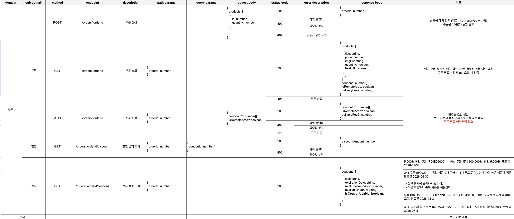

### API 명세서 링크

https://docs.google.com/spreadsheets/d/1SvIxcKaGHvVGesTzHZ6CAiv-TSV1QzqqHnmkl1qRpWI/edit?gid=0#gid=0

1. POST /orders : 주문 생성
   상품 예약을 거는 lock 시점을 주문 생성 시점으로 설정하였습니다. 주문 확인 페이지에 진입하는 순간부터 쿠폰이 만료되는 기간 등을 보장하고 싶었기 때문이였습니다. 주문은 생성 시점으로부터 10분간 유효하고, 만료된 주문은 BE 스케줄러가 1분 주기로 감지하여 isExpired를 true로 업데이트하고 상품 예약을 해제합니다. 만료 처리를 사용자 요청에 종속시키지 않고 스케줄러로 분리한 이유는, 사용자가 페이지를 떠나고 돌아오지 않는 경우에도 lock이 반드시 해제되도록 보장하기 위함입니다.

2. GET /orders/:orderId : 주문 조회
   주문 확인 페이지의 모든 화면 상태인 상품 목록, 쿠폰, 배송비, 도서산간 여부의 원천을 이 API 하나로 통일하였습니다. FE가 상태를 직접 가공하거나 이전 응답 값을 재활용하지 않고 매번 서버로부터 최신 상태를 받아 렌더링하는 방식으로 SSOT를 유지할 수 있기 때문입니다. 이미 주문이 생성된 이후이므로 상품 품절 여부는 이 시점에 별도로 검증하지 않으며, 쿠폰 만료 여부는 결제 API 호출 시점에 최종 검증합니다.

3. PATCH /orders/:orderId : 주문 변경
   쿠폰 선택 및 도서산간 여부 변경을 모두 이 엔드포인트로 처리합니다. 쿠폰 정보와 배송 정보 모두 order 테이블에서 관리하기 때문에, 변경 사항을 항상 서버에 먼저 반영한 뒤 GET으로 최신 상태를 다시 조회하는 방식을 일관되게 유지합니다. 쿠폰 만료 여부는 이 시점에도 검증하며, 만료된 경우 404를 반환합니다. 비고란에 "주문 만료 예외처리 필요"로 표기한 것은 PATCH 요청 시점에도 주문 자체가 만료되었을 가능성이 있기 때문입니다.

4. GET /orders/:orderId/discount : 할인 금액 조회
   할인 금액 계산을 FE가 아닌 BE에 위임한 핵심 근거는 쿠폰 적용 순서에 따라 최종 할인 금액이 달라지기 때문입니다. 예를 들어 5,000원 정액 쿠폰을 먼저 적용한 뒤 30% 쿠폰을 적용하는 경우와 그 반대의 경우 결과가 달라집니다. 이 문제를 해결하기 위해 BE가 항상 최대 할인이 되는 순서로 쿠폰을 적용하는 정책을 가지고, FE는 선택된 couponId 배열만 넘기고 결과값인 discountAmount만 받아 화면에 표시합니다. 쿠폰 수가 많아질 경우 FE에서 정렬과 조합 연산을 수행하면 성능 이슈가 발생할 수 있다는 점도 서버 위임의 이유 중 하나였습니다.
   주문 금액과 배송비는 FE가 계산하고 쿠폰 할인만 BE가 계산하는 구조에 대해, 총 결제 금액이 FE와 BE 양쪽에 걸쳐 계산되는 것이 SSOT 위반이 아닌지 검토하였습니다. 주문 금액과 배송비는 상품 수량, 단가, 배송지라는 확정된 값에서 파생되는 단순 계산이고, 쿠폰 할인은 복잡한 정책 로직을 포함하므로 책임을 분리하는 것이 적절하다고 판단하였습니다. 총 결제 금액은 이 두 값으로부터 파생되는 값으로, 별도의 SSOT 엔드포인트를 두기보다 FE에서 합산하는 방식을 선택하였습니다.

5. GET /orders/:orderId/coupons : 쿠폰 정보 조회
   쿠폰 목록과 함께 각 쿠폰의 사용 가능 여부를 BE가 계산하여 내려줍니다. FE가 쿠폰 정책을 직접 알 필요 없이 isCouponUsable 값에 따라 UI의 disabled 처리만 담당합니다. 이를 통해 쿠폰 정책이 변경되더라도 FE 코드 수정 없이 BE 응답만 변경하면 되는 구조를 만들었습니다. availableHours 필드를 응답에 포함하는 이유는 시간제 쿠폰의 경우 사용 가능 시간대를 UI에 표시해야 하기 때문입니다.
