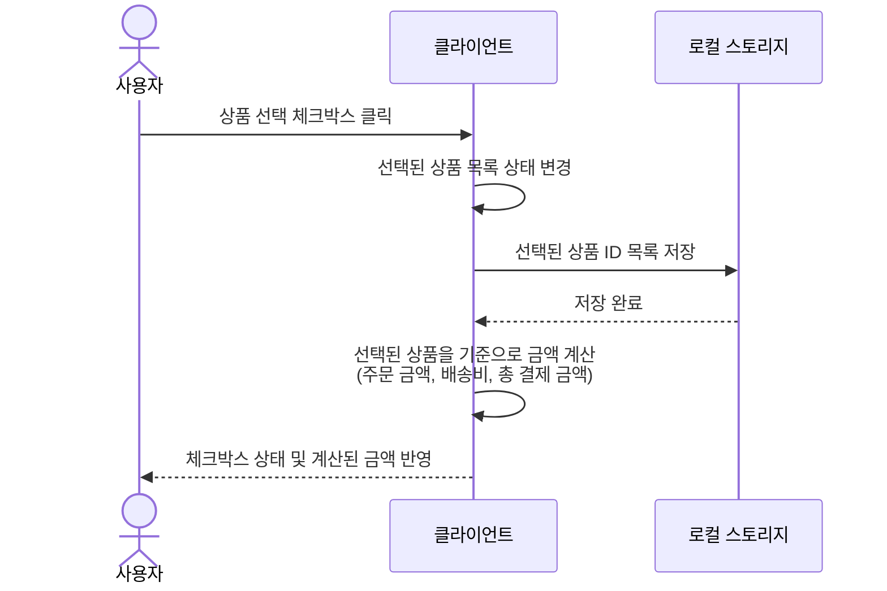
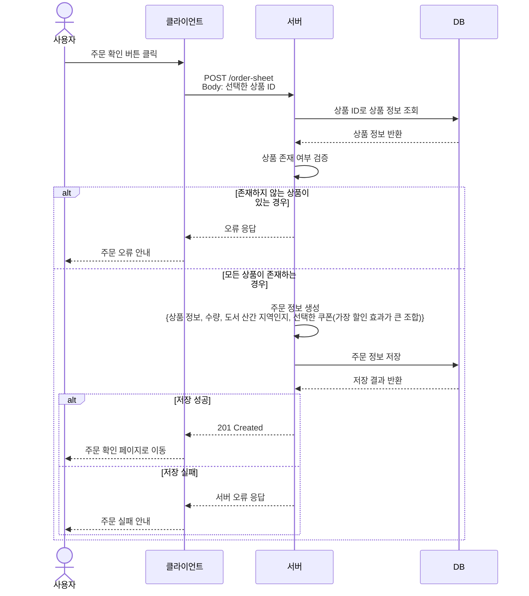
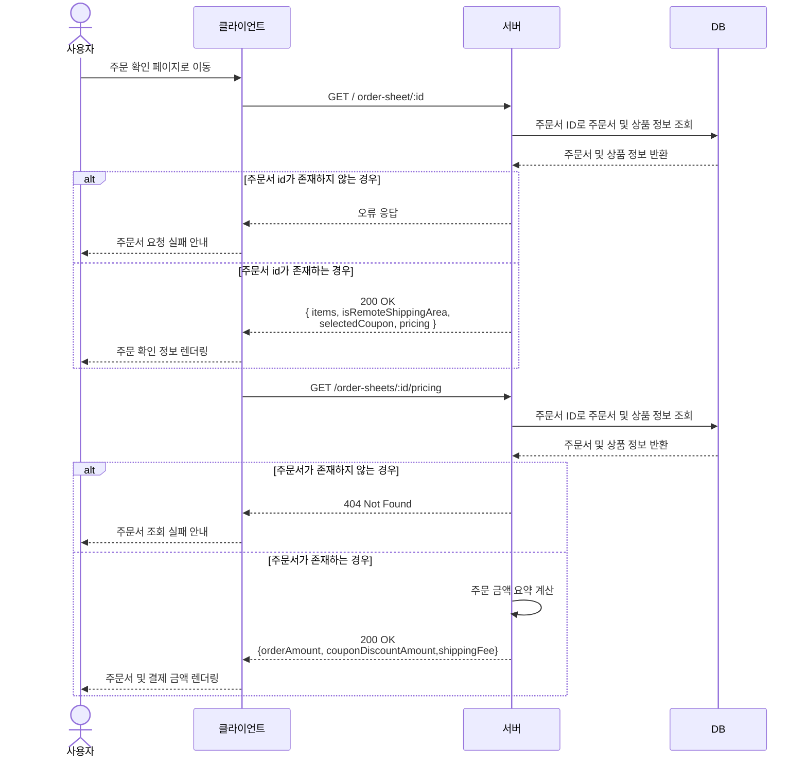
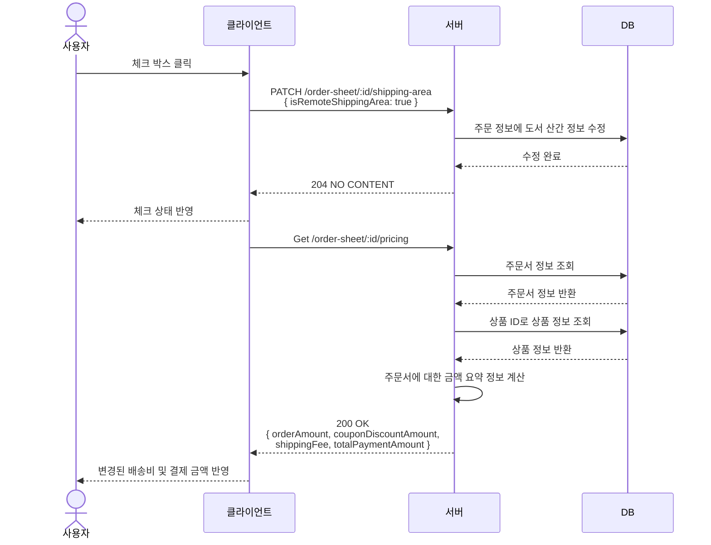
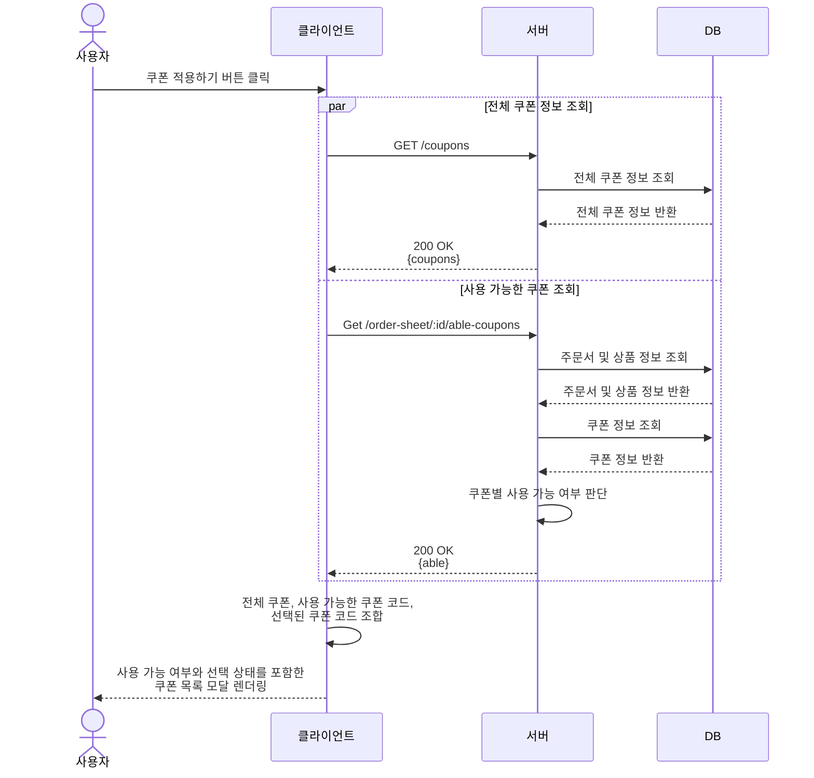
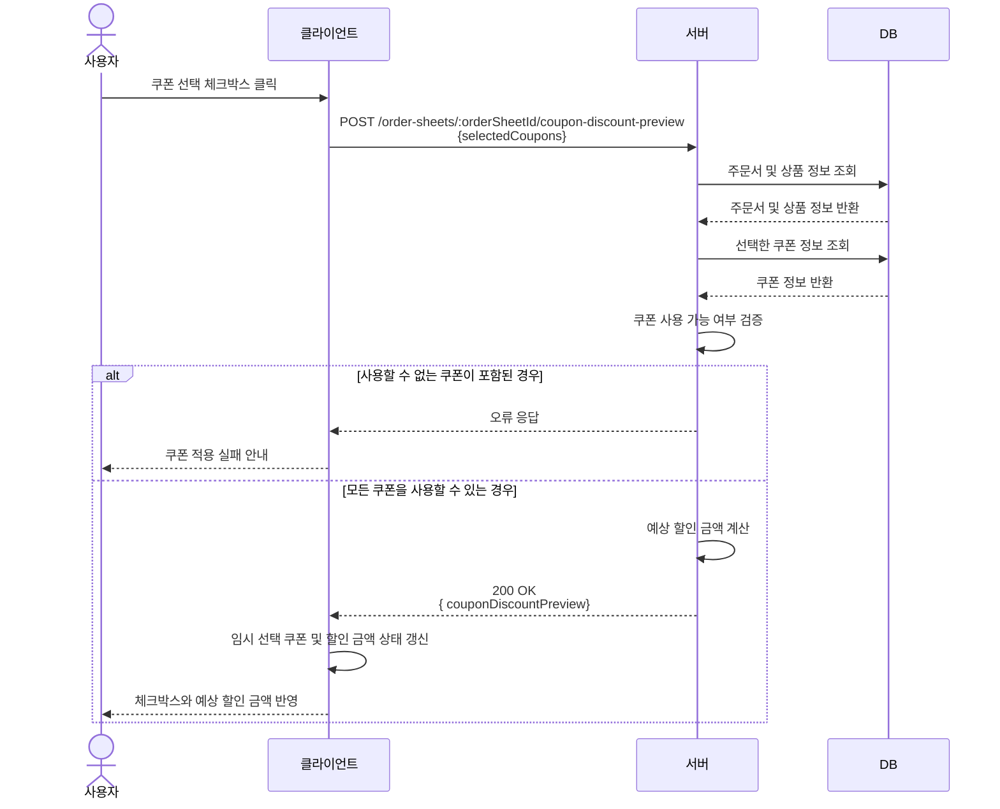
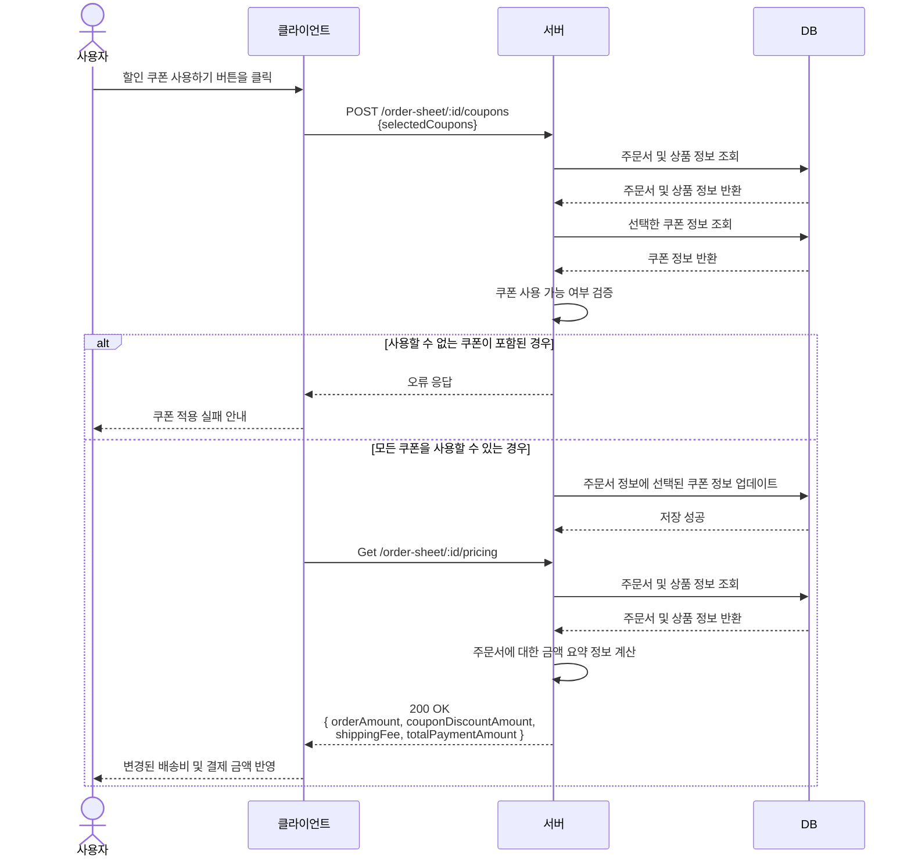

## 장바구니 화면: 상품 목록 선택 박스를 클릭 했을 때

## 장바구니 화면: 주문 확인 버튼을 클릭 했을 때

## 주문 확인 페이지: 화면 진입

## 주문 확인 페이지: 제주도 및 도서 산간 지역 선택 박스를 클릭했을 때

## 주문 확인 페이지: 쿠폰 적용하기 버튼을 클릭 했을 때

## 주문 확인 페이지: 쿠폰 선택 박스 버튼을 클릭 했을 때

## 주문 확인 페이지: 할인 쿠폰 사용하기 버튼을 클릭 했을 때

