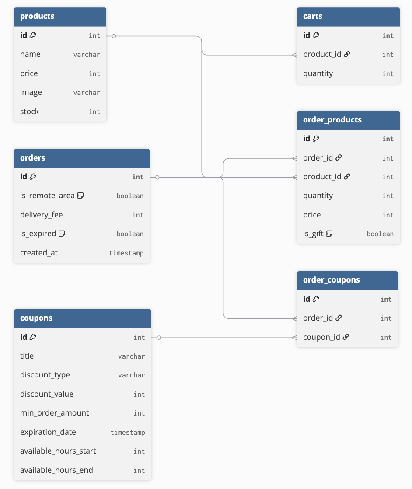

# 장바구니 4단계 구현 목록

## DB 설계

## BE 구현 목록

### 1. 주문 생성

| 항목        | 값        |
| ----------- | --------- |
| URI         | `/orders` |
| Method      | `POST`    |
| Status Code | `201`     |

#### 필요한 상황

- 주문 확인 클릭 시

#### 시나리오

정상 케이스

- [x] 사용자가 주문한 상품을 product DB에 예약한다. (UPDATE products)
- [x] DB에서 쿠폰 전체를 조회한다. (SELECT coupons)
- [x] 가장 할인율이 높은 쿠폰 2개를 계산한다.
- [x] orders 테이블에 주문 레코드를 생성한다. (orderID를 추가한다.)
- [x] order_coupon 테이블에 쿠폰을 추가한다.
- [x] order_products 테이블에 주문한 상품들을 저장한다.
- [x] 주문 번호(orderId)를 프론트에게 반환한다.

실패 케이스

- [x] 타입 불일치 시 400 반환
- [x] 필수값 누락 시 400 반환
- [x] 수량이 0인 경우 404 반환

---

### 2. 주문 조회

| 항목        | 값                 |
| ----------- | ------------------ |
| URI         | `/orders/:orderId` |
| Method      | `GET`              |
| Status Code | `200`              |

#### 필요한 상황

- 처음 주문 확인 페이지 진입 시
- 쿠폰 사용하기 버튼 클릭 후 주문 재조회 시

#### 시나리오

정상 케이스

- [x] DB에서 order, order_products, order_coupons 를 조회한다. (SELECT order, product)
- [x] products, coupons, isRemoteArea, deliveryFee를 프론트에게 반환한다.
- [x] 주문 만료 여부를 검사한다. (후순위)

실패 케이스

- [x] 주문이 만료된 경우 404 반환 (후순위)

---

### 3. 쿠폰 조회

| 항목        | 값                         |
| ----------- | -------------------------- |
| URI         | `/orders/:orderId/coupons` |
| Method      | `GET`                      |
| Status Code | `200`                      |

#### 필요한 상황

- 쿠폰 적용 버튼 클릭 시

#### 시나리오

정상 케이스

- [x] DB에서 coupon과 order_products를 조회한다.
- [x] 각 쿠폰의 사용 가능 여부를 계산한다. (최소 주문 금액, 만료일, 사용 가능 시간 등)
- [x] 쿠폰 전체 정보와 사용 가능 여부(isCouponUsable)를 반환한다.

---

### 4. 주문 변경

| 항목        | 값                 |
| ----------- | ------------------ |
| URI         | `/orders/:orderId` |
| Method      | `PATCH`            |
| Status Code | `200`              |

#### 필요한 상황

- 쿠폰 사용하기 버튼 클릭 시
- 제주도 및 도서 산간 지역 체크박스 클릭 시

#### 시나리오

정상 케이스

- [x] request body에 따라 쿠폰 또는 배송지 정보를 업데이트한다.
- [x] 쿠폰 변경 시: order_coupons에 선택된 쿠폰을 업데이트한다. (2+1 쿠폰의 경우 hasGift도 변경)
- [x] 배송지 변경 시: order의 isRemoteArea를 업데이트한다.
- [x] 변경된 항목을 응답한다.

실패 케이스

- [x] 타입 불일치 시 400 반환
- [x] 필수값 누락 시 400 반환
- [x] 쿠폰 만료 시 404 반환 (쿠폰 변경 요청 시에만 해당)

---

### 5. 할인 금액 조회 (미사용)

| 항목        | 값                          |
| ----------- | --------------------------- |
| URI         | `/orders/:orderId/discount` |
| Method      | `GET`                       |
| Status Code | `200`                       |

> 할인 금액은 체크박스 클릭 시 FE에서 계산하여 빠른 피드백을 제공하고, 결제하기 버튼 클릭 시점에 BE가 최종 검증하는 방식으로 변경하여 이 API는 사용하지 않음!

---

### 6. 결제하기

| 항목        | 값          |
| ----------- | ----------- |
| URI         | `/payments` |
| Method      | `POST`      |
| Status Code | `201`       |

#### 필요한 상황

- 결제하기 버튼 클릭 시

#### 시나리오

정상 케이스

- [x] DB에서 order, order_products, order_coupons를 조회한다.
- [x] 쿠폰 만료 여부를 검증한다.
- [x] 할인 금액을 계산하고 FE에서 넘어온 금액과 비교하여 검증한다.
- [x] 최종 결제 금액을 반환한다.

실패 케이스

- [x] 결제 금액 불일치 시 400 반환 → 장바구니 페이지로 리다이렉트
- [x] 쿠폰 만료 시 404 반환
  - [x] 만료된 쿠폰을 order_coupons에서 제거한다. (UPDATE order / DELETE coupon)
  - [x] 사용자에게 쿠폰 만료 alert를 보여준다.
  - [x] 확인 클릭 시 GET /orders/:orderId로 주문 정보를 재조회한다.
  - [x] FE에서 할인 금액을 재계산하여 화면을 업데이트한다.

---

### 7. 주문 만료 스케줄러 (후순위로 둘 예정!)

#### 시나리오

- [ ] 1분마다 주문 만료 여부를 체크한다.
- [ ] 만료된 주문의 isExpired를 true로 변경한다. (UPDATE orders)
- [ ] 예약된 상품 재고를 취소한다. (UPDATE products)
