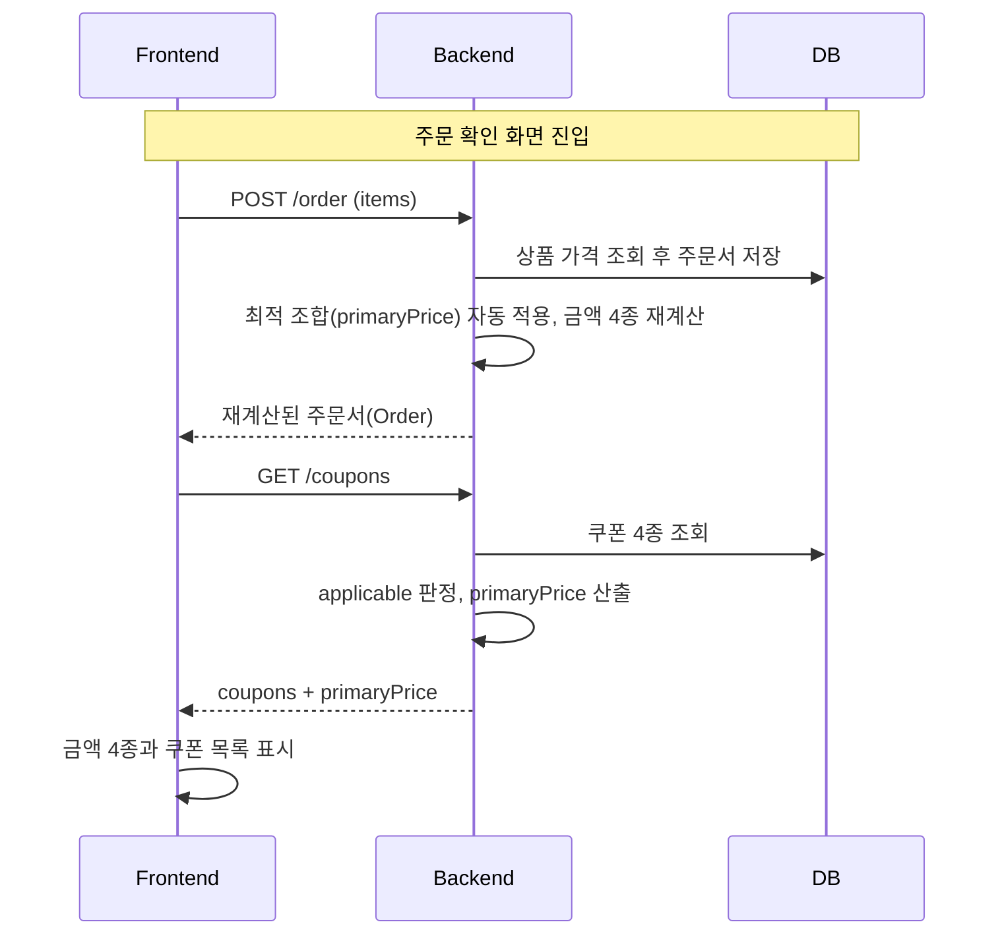
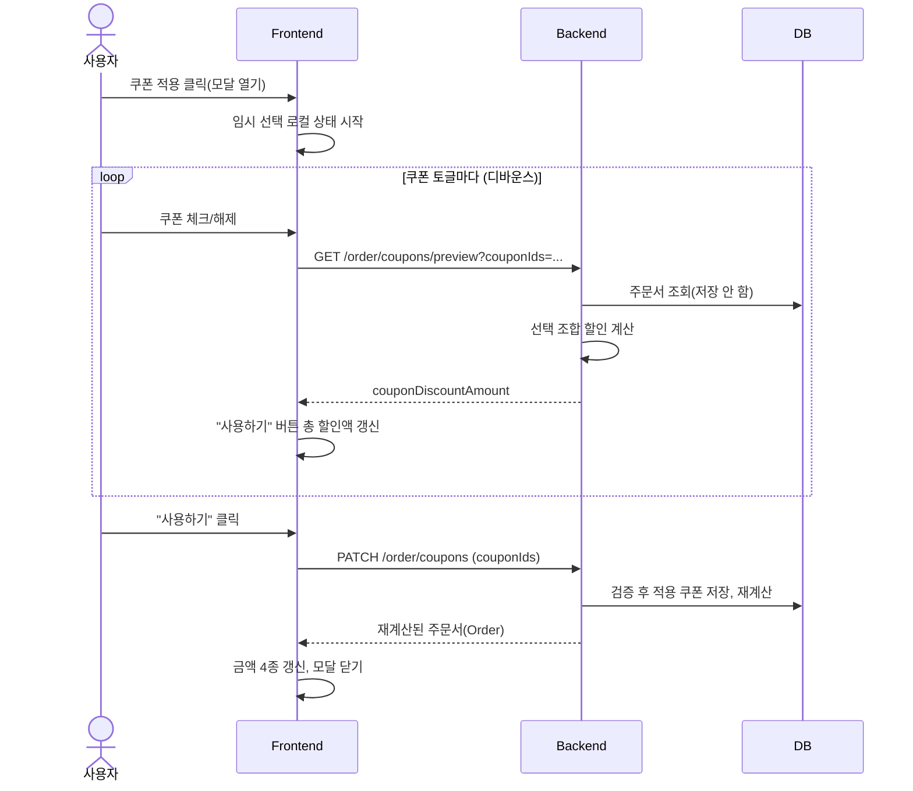
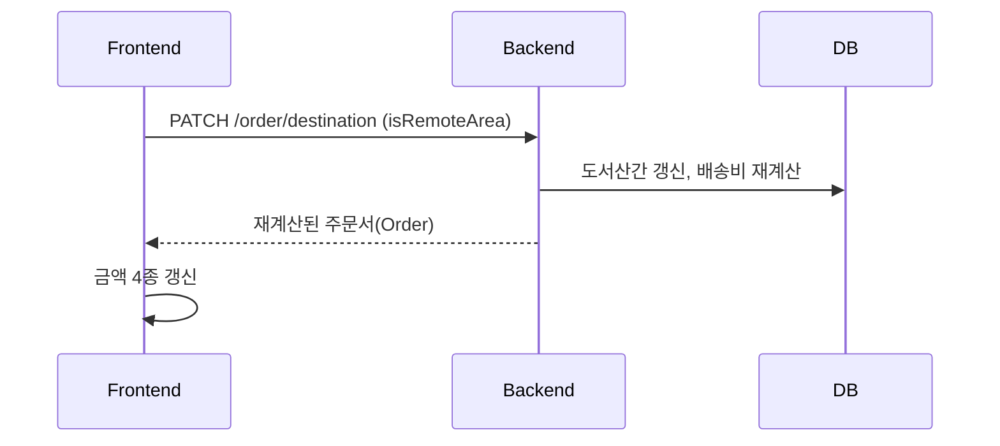

# 시스템 설계 — 쿠폰과 배송비 (Step 3)

## 설계 원칙: SSOT를 어디에 둘 것인가

스펙의 제약: "쿠폰을 적용하고, 결제 금액을 확인하는 과정에서 클라이언트가 임의로 계산하지
않도록 설계한다."

구현 방식: 금액이 결정되는 값(쿠폰 판정, 할인액, 금액 4종)은 전부 서버가 계산해 응답한다.
Frontend는 식별자와 플래그(주문 항목의 `productId`, `couponIds`, `isRemoteArea`)만 보내고
금액은 받기만 한다. 요청에 가격이나 금액을 싣지 않는다. 클라이언트가 보낸 금액은 결국 서버가
검증해야 할 입력이 되므로, 처음부터 받지 않고 DB 원본을 조회한다.

### 상태 책임표

| 상태 | SSOT (원천) | Frontend 역할 | Backend 역할 |
| --- | --- | --- | --- |
| 상품 정보와 가격 | DB | 표시 | 조회 제공 |
| 장바구니 (수량) | DB | 표시 + 수량 변경 요청 (step 2) | `GET/PATCH/DELETE /cart` |
| 상품 선택 여부 | LocalStorage (클라 상태) | 소유, 지속 (step 2 `useSelection`) | 모름. 주문서 등록 시 항목으로 변환되어 전달 |
| 주문서 (항목, 적용 쿠폰, 도서산간, 금액) | DB (서버) | 표시 + 갱신 요청 | `POST /order`가 생성, `PATCH /order/coupons`와 `PATCH /order/destination`이 갱신 |
| 쿠폰 원본 4종 | DB (하드코딩 시드) | 표시 | `GET /coupons`의 재료 |
| 모달 임시 선택 | FE 컴포넌트 로컬 | "사용하기"로 apply 요청, 닫으면 폐기 | 모름 |
| 쿠폰별 적용 가능 여부 (`applicable`) | BE 계산 응답 | 표시 전용 (비활성화 처리) | 현재 주문서 + 서버 시계로 판정 |
| 최적 조합 (`primaryPrice`) | BE 계산 응답 | 표시 + 적용 트리거 (apply 호출) | 적용 가능 조합 전수 평가로 산출 |
| 토글 중 예상 할인 | BE 계산 응답 (`GET /order/coupons/preview`) | 디바운스 호출로 버튼 총 할인액 표시 (클라 계산 없음) | 저장 없이 선택 조합만 계산해 반환 |
| 금액 4종 (주문, 할인, 배송비, 총액) | BE 계산 응답 | 표시 전용, FE는 이 값을 만들지 않는다 | apply와 PATCH 때마다 재계산해 주문서에 저장 |
| 판정 시각 (만료, 시간대) | BE 시계 | 시간 판정 안 함 | 단일 기준 |

중복 원천을 피하기 위해 두 가지를 정해둔다:

- 선택 여부의 원천은 LocalStorage이고, 주문서의 항목은 "주문 확인을 누른 시점"의 스냅샷(파생물)이다. 장바구니로 돌아가 선택을 바꾸고 다시 제출하면 주문서가 덮어써진다. 스냅샷은 갱신될 뿐 원천이 되지 않는다.
- 장바구니 화면(step 2)의 합계 표시는 쿠폰이 개입하지 않는 순수 파생값이라 클라 계산을 유지한다. 금지의 경계는 쿠폰 적용 과정부터 결제 금액 확인 과정으로 보았다.

## 시퀀스 다이어그램

계산이 일어나는 메시지만 표시한다. BOGO 대상 상품 판정과 정률 상한은 BE 계산 박스 안에서 끝나 화살표로 드러나지 않는다.

### 주문 확인 화면 진입과 최적 조합 자동 적용

### 쿠폰 모달 토글과 확정 (preview는 비저장, PATCH는 저장)

### 도서산간 토글

