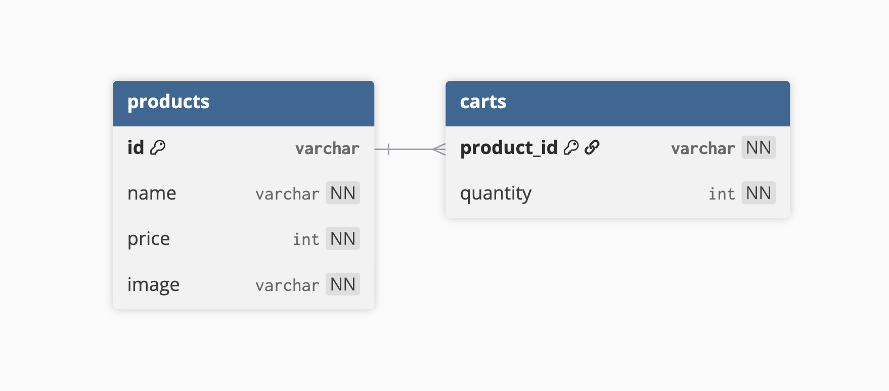

# API 명세

## 상품

### 데이터

- 고유 ID(id)
- 이름(name)
- 가격(price)
- 이미지(image)

#### 결정 이유

상품명, 가격, 이미지는 상품을 화면에 표시하고 장바구니 기능을 제공하기 위해 필요한 기본 정보이다.  
또한 각 상품을 명확하게 식별하고 관리하기 위해 상품마다 고유 ID를 부여하였다.

### GET

| endpoint  | request body | response body              | http status code(success) | http status code(error) |
| --------- | ------------ | -------------------------- | ------------------------- | ----------------------- |
| /products | X            | [{id, name, price, image}] | 200                       | 404 408 500 501         |

#### 결정 이유

전체 상품 목록을 조회하는 API이므로 REST API 규칙에 따라 엔드포인트를 `/products`로 설정하였다.  
GET 요청은 별도의 요청 본문이 필요하지 않으므로 request body는 `X`로 표시하였다.  
응답으로는 상품 목록을 제공해야 하므로 `[{ id, name, price, image }]` 형태의 객체 배열을 반환한다.  
요청이 성공하면 응답 본문에 상품 목록을 담아 반환하므로 상태 코드는 `200`으로 설정하였다.  
요청이 실패할 경우, 잘못된 경로로 요청한 경우에는 `404`, 요청 시간이 초과된 경우에는 `408`, 서버 내부에서 예상치 못한 오류가 발생한 경우에는 `500`, 서버가 해당 요청을 처리하는 기능을 지원하지 않는 경우에는 `501`을 반환한다.

### POST

| endpoint  | request body         | response body              | http status code(success) | http status code(error) |
| --------- | -------------------- | -------------------------- | ------------------------- | ----------------------- |
| /products | {name, price, image} | [{id, name, price, image}] | 201                       | 400 408 500 501         |

#### 결정 이유

새로운 상품을 추가하는 API이므로 REST API 규칙에 따라 엔드포인트를 `/products`로 설정하였다.  
POST 요청 시 상품 생성에 필요한 이름, 가격, 이미지를 request body로 전달한다.  
상품이 추가된 뒤 갱신된 전체 상품 목록을 확인할 수 있도록 `[{ id, name, price, image }]` 형태의 객체 배열을 응답으로 반환한다.  
요청이 성공하면 서버에 새로운 리소스가 생성되었음을 의미하므로 상태 코드는 `201`로 설정하였다.  
요청이 실패할 경우, 요청 본문 형식이 올바르지 않은 경우에는 `400`, 요청 시간이 초과된 경우에는 `408`, 서버 내부에서 예상치 못한 오류가 발생한 경우에는 `500`, 서버가 해당 요청을 처리하는 기능을 지원하지 않는 경우에는 `501`을 반환한다.

### DELETE

| endpoint      | request body | response body | http status code(success) | http status code(error) |
| ------------- | ------------ | ------------- | ------------------------- | ----------------------- |
| /products/:id | X            | X             | 204                       | 404 408 500 501         |

#### 결정 이유

특정 상품을 삭제하는 API이므로 삭제할 상품을 식별할 수 있도록 엔드포인트를 `/products/:id`로 설정하였다.  
DELETE 요청은 요청 본문과 응답 본문이 필요하지 않으므로 request body와 response body는 `X`로 표시하였다.  
요청이 성공하면 응답 본문 없이 처리 결과만 전달하면 되므로 상태 코드는 `204`로 설정하였다.  
요청이 실패할 경우, 잘못된 경로로 요청했거나 삭제할 상품을 찾을 수 없는 경우에는 `404`, 요청 시간이 초과된 경우에는 `408`, 서버 내부에서 예상치 못한 오류가 발생한 경우에는 `500`, 서버가 해당 요청을 처리하는 기능을 지원하지 않는 경우에는 `501`을 반환한다.

## 장바구니

### 데이터

- 상품 ID(productId)
- 수량(quantity)

#### 결정 이유

장바구니는 상품별 수량을 관리해야 하므로, 각 상품을 식별할 수 있는 `productId`와 해당 상품의 수량을 나타내는 `quantity`를 데이터로 사용하였다.  
장바구니를 `Map`으로 관리할 경우, 변경될 수 있는 수량은 key로 사용하기 어렵다. 따라서 상품 객체 전체를 저장하기보다 변하지 않는 상품 ID를 key로 사용하고, 수량을 value로 관리할 수 있도록 `productId`를 별도로 두었다.

### GET

| endpoint | request body | response body                              | http status code(success) | http status code(error) |
| -------- | ------------ | ------------------------------------------ | ------------------------- | ----------------------- |
| /carts   | x            | [{ { id, name, price, image }, quantity }] | 200                       | 404 408 500 501         |

#### 결정 이유

장바구니에 담긴 상품 목록을 조회하는 API이므로 REST API 규칙에 따라 엔드포인트를 `/carts`로 설정하였다.  
GET 요청은 별도의 요청 본문이 필요하지 않으므로 request body는 `X`로 표시하였다.  
응답으로는 장바구니에 담긴 상품 정보와 수량을 함께 제공해야 하므로 상품 정보와 `quantity`를 포함한 객체 배열을 반환한다.  
요청이 성공하면 응답 본문에 장바구니 목록을 담아 반환하므로 상태 코드는 `200`으로 설정하였다.  
요청이 실패할 경우, 잘못된 경로로 요청한 경우에는 `404`, 요청 시간이 초과된 경우에는 `408`, 서버 내부에서 예상치 못한 오류가 발생한 경우에는 `500`, 서버가 해당 요청을 처리하는 기능을 지원하지 않는 경우에는 `501`을 반환한다.

### PATCH

| endpoint   | request body | response body | http status code(success) | http status code(error) |
| ---------- | ------------ | ------------- | ------------------------- | ----------------------- |
| /carts/:id | x            | x             | 204                       | 400 404 408 500 501     |

#### 결정 이유

장바구니에 담긴 특정 상품의 수량을 수정하는 API이므로 수정할 장바구니 항목을 식별할 수 있도록 엔드포인트를 `/carts/:id`로 설정하였다.  
수정 후 별도의 데이터를 다시 반환할 필요가 없으므로 response body는 `X`로 표시하였다.  
요청이 성공하면 응답 본문 없이 처리 결과만 전달하면 되므로 상태 코드는 `204`로 설정하였다.  
요청이 실패할 경우, 수량이 허용 범위를 벗어나는 등 요청 값이 올바르지 않은 경우에는 `400`, 잘못된 경로로 요청했거나 수정할 항목을 찾을 수 없는 경우에는 `404`, 요청 시간이 초과된 경우에는 `408`, 서버 내부에서 예상치 못한 오류가 발생한 경우에는 `500`, 서버가 해당 요청을 처리하는 기능을 지원하지 않는 경우에는 `501`을 반환한다.

## DELETE

| endpoint   | request body | response body | http status code(success) | http status code(error) |
| ---------- | ------------ | ------------- | ------------------------- | ----------------------- |
| /carts/:id | x            | x             | 204                       | 404 408 500 501         |

#### 결정 이유

장바구니에 담긴 특정 상품을 삭제하는 API이므로 삭제할 장바구니 항목을 식별할 수 있도록 엔드포인트를 `/carts/:id`로 설정하였다.  
DELETE 요청은 요청 본문과 응답 본문이 필요하지 않으므로 request body와 response body는 `X`로 표시하였다.  
요청이 성공하면 응답 본문 없이 처리 결과만 전달하면 되므로 상태 코드는 `204`로 설정하였다.  
요청이 실패할 경우, 잘못된 경로로 요청했거나 삭제할 항목을 찾을 수 없는 경우에는 `404`, 요청 시간이 초과된 경우에는 `408`, 서버 내부에서 예상치 못한 오류가 발생한 경우에는 `500`, 서버가 해당 요청을 처리하는 기능을 지원하지 않는 경우에는 `501`을 반환한다.
