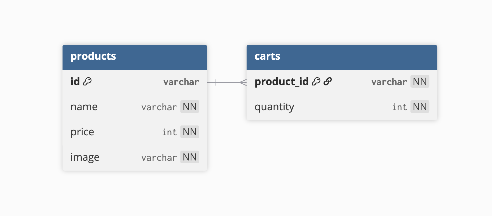

# API 명세

## 상품

### 데이터

- 고유 ID(id)
- 이름(name)
- 가격(price)
- 이미지(image)

#### 결정 이유

상품명, 가격, 이미지는 상품을 화면에 표시하고 장바구니 기능을 제공하기 위해 필요한 기본 정보이다.  
또한 각 상품을 명확하게 식별하고 관리하기 위해 상품마다 고유 ID를 부여하였다.

### GET

| endpoint  | request body | response body              | http status code(success) | http status code(error) |
| --------- | ------------ | -------------------------- | ------------------------- | ----------------------- |
| /products | X            | [{id, name, price, image}] | 200                       | 404 408 500 501         |

#### 결정 이유

전체 상품 목록을 조회하는 API이므로 REST API 규칙에 따라 엔드포인트를 `/products`로 설정하였다.  
GET 요청은 별도의 요청 본문이 필요하지 않으므로 request body는 `X`로 표시하였다.  
응답으로는 상품 목록을 제공해야 하므로 `[{ id, name, price, image }]` 형태의 객체 배열을 반환한다.  
요청이 성공하면 응답 본문에 상품 목록을 담아 반환하므로 상태 코드는 `200`으로 설정하였다.  
요청이 실패할 경우, 잘못된 경로로 요청한 경우에는 `404`, 요청 시간이 초과된 경우에는 `408`, 서버 내부에서 예상치 못한 오류가 발생한 경우에는 `500`, 서버가 해당 요청을 처리하는 기능을 지원하지 않는 경우에는 `501`을 반환한다.

### POST

| endpoint  | request body         | response body              | http status code(success) | http status code(error) |
| --------- | -------------------- | -------------------------- | ------------------------- | ----------------------- |
| /products | {name, price, image} | [{id, name, price, image}] | 201                       | 400 404 408 500 501     |

#### 결정 이유

새로운 상품을 추가하는 API이므로 REST API 규칙에 따라 엔드포인트를 `/products`로 설정하였다.  
POST 요청 시 상품 생성에 필요한 이름, 가격, 이미지를 request body로 전달한다.  
상품이 추가된 뒤 갱신된 전체 상품 목록을 확인할 수 있도록 `[{ id, name, price, image }]` 형태의 객체 배열을 응답으로 반환한다.  
요청이 성공하면 서버에 새로운 리소스가 생성되었음을 의미하므로 상태 코드는 `201`로 설정하였다.  
요청이 실패할 경우, 요청 본문 형식이 올바르지 않은 경우에는 `400`, 요청 시간이 초과된 경우에는 `408`, 서버 내부에서 예상치 못한 오류가 발생한 경우에는 `500`, 서버가 해당 요청을 처리하는 기능을 지원하지 않는 경우에는 `501`을 반환한다.

### DELETE

| endpoint      | request body | response body | http status code(success) | http status code(error) |
| ------------- | ------------ | ------------- | ------------------------- | ----------------------- |
| /products/:id | X            | X             | 204                       | 404 408 500 501         |

#### 결정 이유

특정 상품을 삭제하는 API이므로 삭제할 상품을 식별할 수 있도록 엔드포인트를 `/products/:id`로 설정하였다.  
DELETE 요청은 요청 본문과 응답 본문이 필요하지 않으므로 request body와 response body는 `X`로 표시하였다.  
요청이 성공하면 응답 본문 없이 처리 결과만 전달하면 되므로 상태 코드는 `204`로 설정하였다.  
요청이 실패할 경우, 잘못된 경로로 요청했거나 삭제할 상품을 찾을 수 없는 경우에는 `404`, 요청 시간이 초과된 경우에는 `408`, 서버 내부에서 예상치 못한 오류가 발생한 경우에는 `500`, 서버가 해당 요청을 처리하는 기능을 지원하지 않는 경우에는 `501`을 반환한다.

## 장바구니

### 데이터

- 상품 ID(productId)
- 수량(quantity)
- 선택 여부(isSelected)

#### 결정 이유

장바구니는 상품별 수량과 선택 상태를 관리해야 하므로, 각 상품을 식별할 수 있는 `productId`, 해당 상품의 수량을 나타내는 `quantity`, 선택 여부를 나타내는 `isSelected`를 데이터로 사용하였다.  
장바구니를 `Map`으로 관리할 경우, 변경될 수 있는 수량은 key로 사용하기 어렵다. 따라서 상품 객체 전체를 저장하기보다 변하지 않는 상품 ID를 key로 사용하고, 수량을 value로 관리할 수 있도록 `productId`를 별도로 두었다.

### GET

| endpoint | request body | response body                                          | http status code(success) | http status code(error) |
| -------- | ------------ | ------------------------------------------------------ | ------------------------- | ----------------------- |
| /carts   | x            | [{ { id, name, price, image }, quantity, isSelected }] | 200                       | 404 408 500 501         |

#### 결정 이유

장바구니에 담긴 상품 목록을 조회하는 API이므로 REST API 규칙에 따라 엔드포인트를 `/carts`로 설정하였다.  
GET 요청은 별도의 요청 본문이 필요하지 않으므로 request body는 `X`로 표시하였다.  
응답으로는 장바구니에 담긴 상품 정보, 수량, 선택 상태를 함께 제공해야 하므로 상품 정보와 `quantity`, `isSelected`를 포함한 객체 배열을 반환한다.  
요청이 성공하면 응답 본문에 장바구니 목록을 담아 반환하므로 상태 코드는 `200`으로 설정하였다.  
요청이 실패할 경우, 잘못된 경로로 요청한 경우에는 `404`, 요청 시간이 초과된 경우에는 `408`, 서버 내부에서 예상치 못한 오류가 발생한 경우에는 `500`, 서버가 해당 요청을 처리하는 기능을 지원하지 않는 경우에는 `501`을 반환한다.

### GET - 결제 금액 정보 조회

| endpoint              | request body | response body | http status code(success) | http status code(error) |
| --------------------- | ------------ | ------------- | ------------------------- | ----------------------- |
| /carts/amount-summary | x            | {amount}      | 200                       | 404 408 500 501         |

#### 결정 이유

장바구니에서 선택된 상품을 기준으로 결제 금액 정보를 조회하는 API이므로 장바구니 리소스 하위에 `/carts/amount-summary` 엔드포인트를 두었다.  
GET 요청은 결제 금액 정보를 조회하는 역할만 수행하므로 별도의 request body는 필요하지 않다.  
응답으로는 주문 금액, 배송비, 총 결제 금액 등 장바구니 페이지에 표시할 결제 금액 정보를 포함한 `amount` 객체를 반환한다.  
요청이 성공하면 계산된 결제 금액 정보를 응답 본문에 담아 반환하므로 상태 코드는 `200`으로 설정하였다.  
요청이 실패할 경우, 잘못된 경로로 요청한 경우에는 `404`, 요청 시간이 초과된 경우에는 `408`, 서버 내부에서 예상치 못한 오류가 발생한 경우에는 `500`, 서버가 해당 요청을 처리하는 기능을 지원하지 않는 경우에는 `501`을 반환한다.

### PATCH - 전체 상품 선택 및 선택 해제

| endpoint | request body | response body | http status code(success) | http status code(error) |
| -------- | ------------ | ------------- | ------------------------- | ----------------------- |
| /carts   | {isSelected} | x             | 204                       | 400 404 408 500 501     |

#### 결정 이유

장바구니에 담긴 모든 상품의 선택 여부를 한 번에 수정하는 API이므로 장바구니 컬렉션 리소스인 `/carts` 엔드포인트를 사용하였다.  
PATCH 요청 시 전체 상품에 적용할 선택 여부를 나타내는 `isSelected`를 request body로 전달한다.  
수정 후 별도의 데이터를 다시 반환할 필요가 없으므로 response body는 `X`로 표시하였다.  
요청이 성공하면 응답 본문 없이 처리 결과만 전달하면 되므로 상태 코드는 `204`로 설정하였다.  
요청이 실패할 경우, 선택 여부 값이 올바르지 않은 경우에는 `400`, 잘못된 경로로 요청한 경우에는 `404`, 요청 시간이 초과된 경우에는 `408`, 서버 내부에서 예상치 못한 오류가 발생한 경우에는 `500`, 서버가 해당 요청을 처리하는 기능을 지원하지 않는 경우에는 `501`을 반환한다.

### PATCH - 상품 선택 및 수량 수정

| endpoint   | request body           | response body | http status code(success) | http status code(error) |
| ---------- | ---------------------- | ------------- | ------------------------- | ----------------------- |
| /carts/:id | {quantity, isSelected} | x             | 204                       | 400 404 408 500 501     |

#### 결정 이유

장바구니에 담긴 특정 상품의 선택 여부와 수량을 수정하는 API이므로 수정할 장바구니 항목을 식별할 수 있도록 엔드포인트를 `/carts/:id`로 설정하였다.  
이때 `:id`는 장바구니에 담긴 상품을 식별하기 위한 상품 ID를 의미한다.  
PATCH 요청 시 변경할 수량인 `quantity`와 선택 여부를 나타내는 `isSelected`를 request body로 전달한다.  
수정 후 별도의 데이터를 다시 반환할 필요가 없으므로 response body는 `X`로 표시하였다.  
요청이 성공하면 응답 본문 없이 처리 결과만 전달하면 되므로 상태 코드는 `204`로 설정하였다.  
요청이 실패할 경우, 수량이 허용 범위를 벗어나거나 선택 여부 값이 올바르지 않은 경우에는 `400`, 잘못된 경로로 요청했거나 수정할 항목을 찾을 수 없는 경우에는 `404`, 요청 시간이 초과된 경우에는 `408`, 서버 내부에서 예상치 못한 오류가 발생한 경우에는 `500`, 서버가 해당 요청을 처리하는 기능을 지원하지 않는 경우에는 `501`을 반환한다.

## DELETE

| endpoint   | request body | response body | http status code(success) | http status code(error) |
| ---------- | ------------ | ------------- | ------------------------- | ----------------------- |
| /carts/:id | x            | x             | 204                       | 404 408 500 501         |

#### 결정 이유

장바구니에 담긴 특정 상품을 삭제하는 API이므로 삭제할 장바구니 항목을 식별할 수 있도록 엔드포인트를 `/carts/:id`로 설정하였다.  
DELETE 요청은 요청 본문과 응답 본문이 필요하지 않으므로 request body와 response body는 `X`로 표시하였다.  
요청이 성공하면 응답 본문 없이 처리 결과만 전달하면 되므로 상태 코드는 `204`로 설정하였다.  
요청이 실패할 경우, 잘못된 경로로 요청했거나 삭제할 항목을 찾을 수 없는 경우에는 `404`, 요청 시간이 초과된 경우에는 `408`, 서버 내부에서 예상치 못한 오류가 발생한 경우에는 `500`, 서버가 해당 요청을 처리하는 기능을 지원하지 않는 경우에는 `501`을 반환한다.

## 주문

### 데이터

- 주문 ID(id)
- 주문 상품 목록(items)
- 결제 금액 정보(amount)

#### 결정 이유

주문은 장바구니에서 선택한 상품을 기준으로 생성되므로 주문을 식별하기 위한 고유 ID와 주문 대상 상품 목록이 필요하다.  
또한 주문 확인 페이지에서 결제 금액을 표시해야 하므로 주문 금액, 할인 금액, 배송비, 총 결제 금액을 포함한 결제 금액 정보를 함께 관리한다.

### POST - 주문 생성

| endpoint | request body                  | response body | http status code(success) | http status code(error) |
| -------- | ----------------------------- | ------------- | ------------------------- | ----------------------- |
| /orders  | {items: [{productId, quantity}]} | {id}          | 201                       | 400 404 408 500 501     |

#### 결정 이유

선택한 장바구니 상품을 바탕으로 새로운 주문을 생성하는 API이므로 REST API 규칙에 따라 엔드포인트를 `/orders`로 설정하였다.  
POST 요청 시 주문할 상품을 식별할 수 있도록 상품 ID와 수량을 포함한 `items` 배열을 request body로 전달한다.  
주문이 생성된 뒤 프론트엔드가 주문 확인 페이지로 이동할 수 있도록 생성된 주문 ID를 응답으로 반환한다.  
요청이 성공하면 서버에 새로운 주문 리소스가 생성되었음을 의미하므로 상태 코드는 `201`로 설정하였다.  
요청이 실패할 경우, 요청 본문 형식이 올바르지 않거나 선택한 상품 목록이 비어 있는 경우에는 `400`, 요청한 상품을 찾을 수 없는 경우에는 `404`, 요청 시간이 초과된 경우에는 `408`, 서버 내부에서 예상치 못한 오류가 발생한 경우에는 `500`, 서버가 해당 요청을 처리하는 기능을 지원하지 않는 경우에는 `501`을 반환한다.

### GET - 주문 정보 조회

| endpoint    | request body | response body                    | http status code(success) | http status code(error) |
| ----------- | ------------ | -------------------------------- | ------------------------- | ----------------------- |
| /orders/:id | x            | {isRemoteArea, products, amount} | 200                       | 404 408 500 501         |

#### 결정 이유

특정 주문의 상세 정보를 조회하는 API이므로 조회할 주문을 식별할 수 있도록 엔드포인트를 `/orders/:id`로 설정하였다.  
GET 요청은 주문 정보를 조회하는 역할만 수행하므로 별도의 request body는 필요하지 않다.  
응답으로는 도서 산간 지역 여부를 나타내는 `isRemoteArea`, 주문 상품 목록인 `products`, 할인 금액이 반영된 결제 금액 정보인 `amount`를 반환한다.  
요청이 성공하면 응답 본문에 주문 정보를 담아 반환하므로 상태 코드는 `200`으로 설정하였다.  
요청이 실패할 경우, 잘못된 경로로 요청했거나 조회할 주문을 찾을 수 없는 경우에는 `404`, 요청 시간이 초과된 경우에는 `408`, 서버 내부에서 예상치 못한 오류가 발생한 경우에는 `500`, 서버가 해당 요청을 처리하는 기능을 지원하지 않는 경우에는 `501`을 반환한다.

### PATCH - 주문 정보 업데이트

| endpoint    | request body   | response body | http status code(success) | http status code(error) |
| ----------- | -------------- | ------------- | ------------------------- | ----------------------- |
| /orders/:id | {isRemoteArea} | x             | 204                       | 400 404 408 500 501     |

#### 결정 이유

특정 주문의 일부 정보를 수정하는 API이므로 수정할 주문을 식별할 수 있도록 엔드포인트를 `/orders/:id`로 설정하였다.  
PATCH 요청 시 도서 산간 지역 여부를 나타내는 `isRemoteArea` 값을 request body로 전달한다.  
서버는 변경된 도서 산간 지역 여부를 주문 정보에 반영하고, 이후 주문 정보 조회 시 배송비와 총 결제 금액을 다시 계산할 수 있도록 한다.  
수정 후 별도의 데이터를 다시 반환할 필요가 없으므로 response body는 `X`로 표시하였다.  
요청이 성공하면 응답 본문 없이 처리 결과만 전달하면 되므로 상태 코드는 `204`로 설정하였다.  
요청이 실패할 경우, 요청 본문 형식이 올바르지 않은 경우에는 `400`, 잘못된 경로로 요청했거나 수정할 주문을 찾을 수 없는 경우에는 `404`, 요청 시간이 초과된 경우에는 `408`, 서버 내부에서 예상치 못한 오류가 발생한 경우에는 `500`, 서버가 해당 요청을 처리하는 기능을 지원하지 않는 경우에는 `501`을 반환한다.

### GET - 주문 쿠폰 목록 조회

| endpoint            | request body | response body                                                                                                              | http status code(success) | http status code(error) |
| ------------------- | ------------ | -------------------------------------------------------------------------------------------------------------------------- | ------------------------- | ----------------------- |
| /orders/:id/coupons | x            | [{id, isSelected, isDisabled, name, dueDate, minOrderAmount, availableTime: {startTime, endTime}}]                         | 200                       | 404 408 500 501         |

#### 결정 이유

특정 주문에 적용할 수 있는 쿠폰 목록을 조회하는 API이므로 주문 리소스 하위에 `/orders/:id/coupons` 엔드포인트를 두었다.  
GET 요청은 쿠폰 목록을 조회하는 역할만 수행하므로 별도의 request body는 필요하지 않다.  
응답으로는 쿠폰 ID, 선택 여부, 사용 불가 여부, 쿠폰명, 만료일, 최소 주문 금액, 사용 가능 시간 정보를 포함한 쿠폰 객체 배열을 반환한다.  
`isSelected`는 현재 주문에 적용된 쿠폰인지 여부를 나타내고, `isDisabled`는 주문 금액, 상품 조건, 사용 가능 시간 등의 조건을 만족하지 않아 선택할 수 없는 쿠폰인지 여부를 나타낸다.  
요청이 성공하면 응답 본문에 쿠폰 목록을 담아 반환하므로 상태 코드는 `200`으로 설정하였다.  
요청이 실패할 경우, 잘못된 경로로 요청했거나 조회할 주문을 찾을 수 없는 경우에는 `404`, 요청 시간이 초과된 경우에는 `408`, 서버 내부에서 예상치 못한 오류가 발생한 경우에는 `500`, 서버가 해당 요청을 처리하는 기능을 지원하지 않는 경우에는 `501`을 반환한다.

### POST - 할인 금액 계산 요청

| endpoint                     | request body       | response body    | http status code(success) | http status code(error) |
| ---------------------------- | ------------------ | ---------------- | ------------------------- | ----------------------- |
| /orders/:id/coupons/discount | {coupons: string[]} | {discountAmount} | 200                       | 400 404 408 500 501     |

#### 결정 이유

사용자가 쿠폰 선택 모달에서 선택한 쿠폰 조합의 할인 금액을 미리 계산하는 API이므로 주문 쿠폰 리소스 하위에 `/orders/:id/coupons/discount` 엔드포인트를 두었다.  
POST 요청 시 할인 금액 계산에 사용할 쿠폰 ID 목록을 `coupons` 배열로 전달한다.  
이 요청은 주문에 쿠폰을 최종 반영하지 않고 선택한 쿠폰 조합의 할인 금액만 계산하므로, 응답으로 `discountAmount`를 반환한다.  
요청이 성공하면 계산된 할인 금액을 응답 본문에 담아 반환하므로 상태 코드는 `200`으로 설정하였다.  
요청이 실패할 경우, 요청 본문 형식이 올바르지 않거나 적용할 수 없는 쿠폰 조합인 경우에는 `400`, 조회할 주문 또는 쿠폰을 찾을 수 없는 경우에는 `404`, 요청 시간이 초과된 경우에는 `408`, 서버 내부에서 예상치 못한 오류가 발생한 경우에는 `500`, 서버가 해당 요청을 처리하는 기능을 지원하지 않는 경우에는 `501`을 반환한다.

### PATCH - 주문 쿠폰 업데이트

| endpoint            | request body       | response body | http status code(success) | http status code(error) |
| ------------------- | ------------------ | ------------- | ------------------------- | ----------------------- |
| /orders/:id/coupons | {coupons: string[]} | x             | 204                       | 400 404 408 500 501     |

#### 결정 이유

특정 주문에 적용할 쿠폰 목록을 업데이트하는 API이므로 주문 쿠폰 리소스를 나타내는 `/orders/:id/coupons` 엔드포인트를 사용하였다.  
PATCH 요청 시 주문에 적용할 쿠폰 ID 목록을 `coupons` 배열로 전달한다.  
서버는 전달받은 쿠폰 목록의 적용 가능 여부를 검증한 뒤 주문 정보에 반영하고, 이후 주문 정보 조회 시 쿠폰 할인 금액과 총 결제 금액을 다시 계산할 수 있도록 한다.  
수정 후 별도의 데이터를 다시 반환할 필요가 없으므로 response body는 `X`로 표시하였다.  
요청이 성공하면 응답 본문 없이 처리 결과만 전달하면 되므로 상태 코드는 `204`로 설정하였다.  
요청이 실패할 경우, 요청 본문 형식이 올바르지 않거나 적용할 수 없는 쿠폰 조합인 경우에는 `400`, 조회할 주문 또는 쿠폰을 찾을 수 없는 경우에는 `404`, 요청 시간이 초과된 경우에는 `408`, 서버 내부에서 예상치 못한 오류가 발생한 경우에는 `500`, 서버가 해당 요청을 처리하는 기능을 지원하지 않는 경우에는 `501`을 반환한다.
